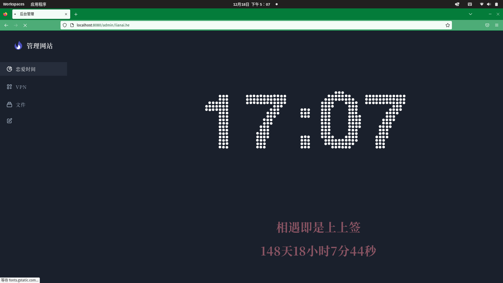
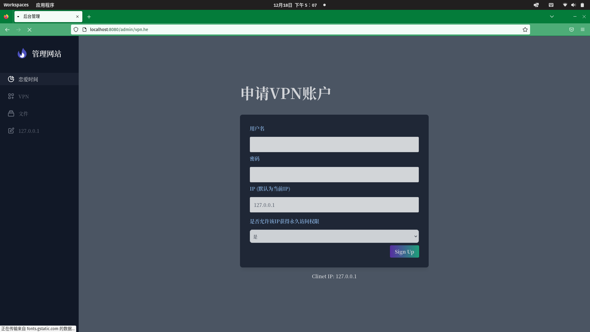
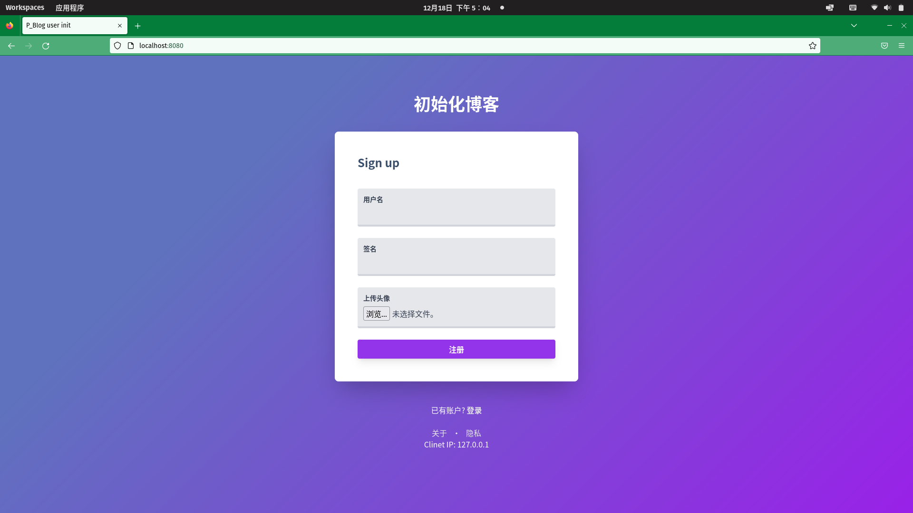
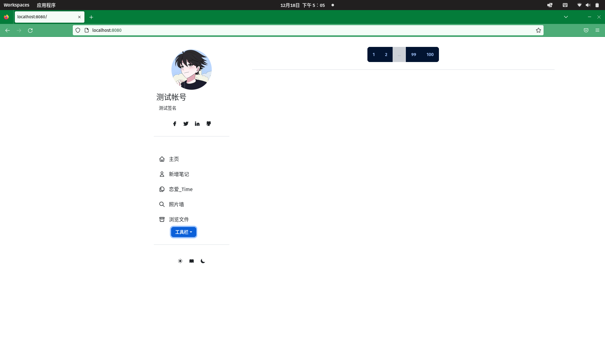
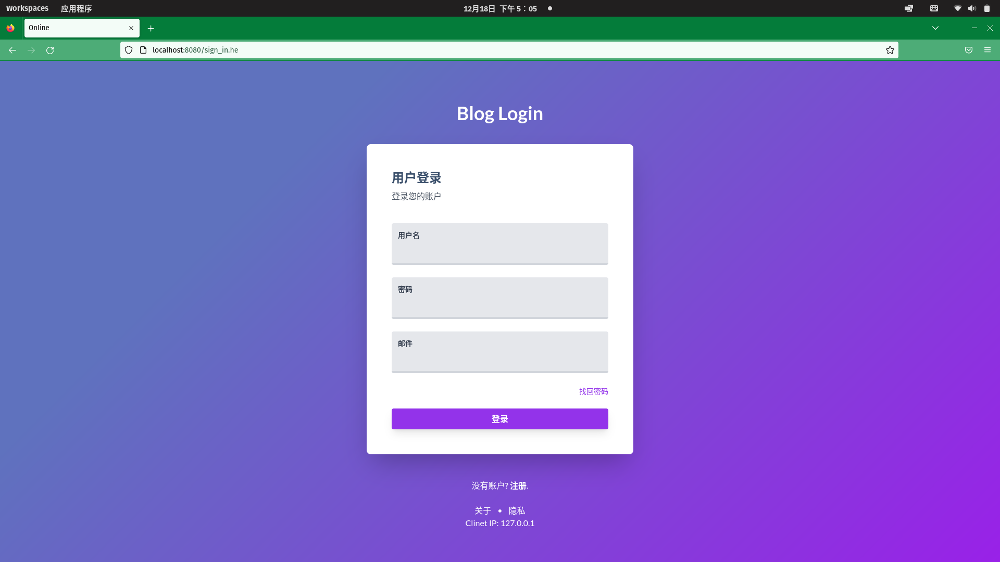
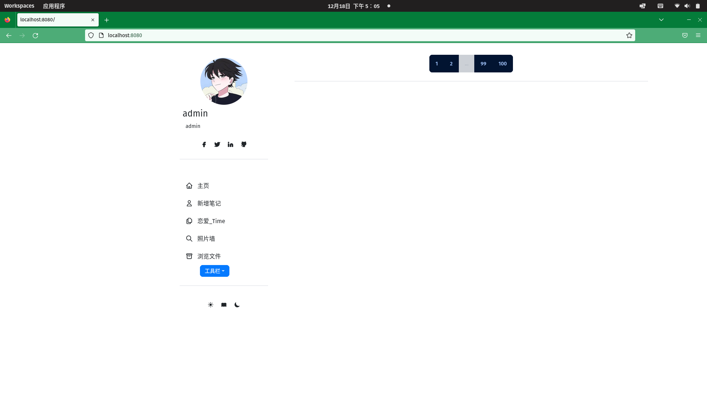
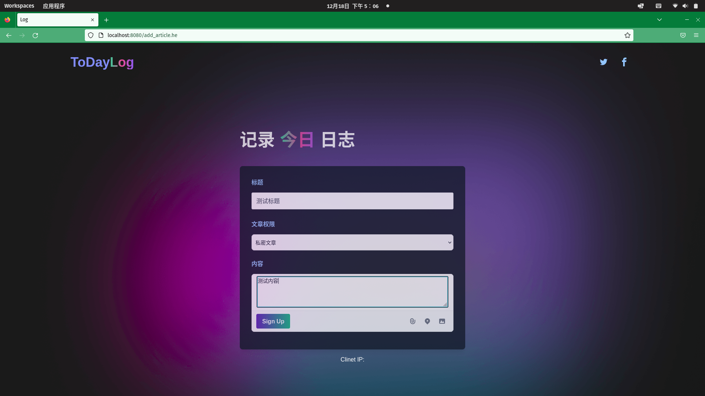
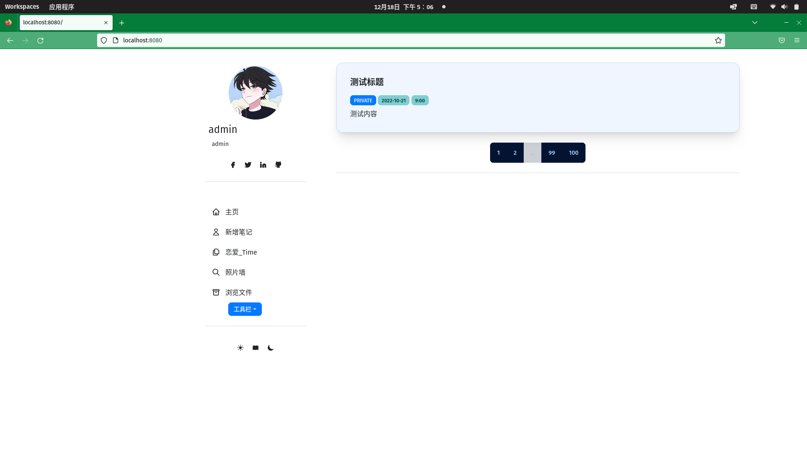

# P_Blog
## Demo










build code need install go env  and "github.com/gin-gonic/gin" package


```bash
go build .
./p_blog
```
open browser href "localhost:8080"

## 默认端口
默认端口为8080, -p 参数  修改端口

